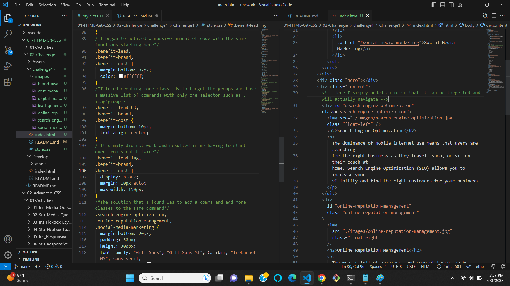
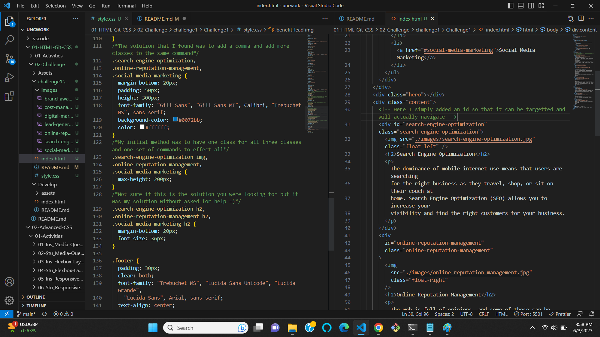

# Refactoring-Scout-Rule

In this week one project we were given a project to recafor the existing code of an existing webpage, which is simply to improve it without changing what it does.

When working with someone else's code you should adhere to the Scout Rule which means to always leave the code a little cleaner then when you found it.

After reading over the initial read.me file of the assignment over and over for an hour I noticed some key words to help me figure out what to clean up. Obviously a main thing to clean up would be the css file but I could not figure out what else to alter. The read me file pointed out accesibility and navigation which lead me to the links at the header. Creating an id tag to reference the link solved that issue. When it came to the css file, I tried for hours to consolidate the coded without altering the image and propperties, I failed. Every step I took backtracked me two steps. After hours of trying to fix the css I decided to start over, includes relinking all the pictures, and fixing the navigation issue. Initially I was creating more classes and ids so I can group the imiages all together, but after trying diffrent things I found the power of a simple comma (,) ! Deffinitly felt ridiculous how I spent hours trying to fix this isue and the solution was a simple comma.

[This is the link to the deployed application](http://127.0.0.1:5501/01-HTML-Git-CSS/02-Challenge/challenge1/Challenge1/index.html#social-media-marketing)

[Http link from my github repo](https://github.com/Kenlau94/Refactoring-Scout-Rule.git)
